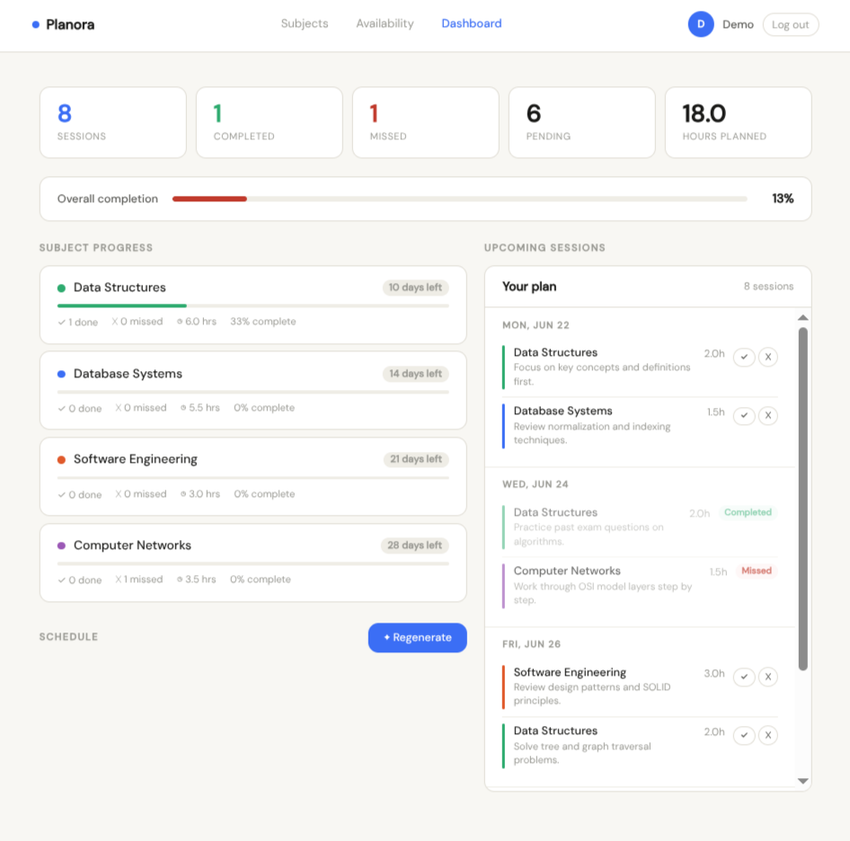

# Planora

**An AI-powered study planner that builds a personalized schedule around your exams, your free time, and what you actually need to study.**

🔗 **Live demo:** [planora-production-cf26.up.railway.app](https://planora-production-cf26.up.railway.app) — click "Try the demo," no signup needed.



---

## Why I built this

Most study planners are glorified to-do lists — you type in a task, you check it off. They don't think about *when* you should study something, *how much* time it deserves, or *what* to focus on.

Planora does. Tell it your subjects, your exam dates, and which days you're actually free — and it generates a real schedule using AI, weighted by how hard each subject is and how close the exam is. Miss a session? It's tracked. Fall behind? The data shows it on your dashboard immediately.

## What it does

- **AI-generated schedules** — powered by Llama 3.3 70B via the Groq API. Give it a course name and (optionally) the topics you need to cover, and it builds session-by-session study blocks with specific, topic-grounded notes — not generic filler like "study the material."
- **Respects your real availability** — pick which days you're free and how many hours, and the schedule never violates those constraints (enforced server-side, not just trusted to the AI).
- **Progress tracking** — mark sessions done or missed with one click. Your completion rate, hours studied, and per-subject progress update live.
- **Adaptive by design** — the schedule reflects reality, not a static plan you made once and ignored.
- **Demo mode** — a fully seeded guest account so anyone can try the whole product without creating an account.

## Tech stack

| Layer | Tech |
|---|---|
| Backend | PHP 8, vanilla — no framework, by choice |
| Database | MySQL |
| AI | Groq API (Llama 3.3 70B) |
| Frontend | HTML, CSS, vanilla JS |
| Hosting | Railway |

No framework was used on purpose. Writing the routing, auth, and data layer by hand was the point — it's the clearest way to actually show how the pieces fit together.

## How the AI scheduling works

1. User adds subjects with a difficulty rating (1–5), an exam date, and optionally a few key topics.
2. User sets which days of the week they're free and how many hours per day.
3. On "Generate schedule," the app builds a prompt combining all of that and sends it to Llama 3.3 via Groq.
4. The AI returns a list of study sessions — date, duration, subject, and a specific note (e.g. *"Practice SQL joins and subqueries"* instead of *"Study the material"*).
5. **Every session is validated server-side** before it touches the database — if the AI schedules something on a day the user didn't select, or after a subject's exam date, it's silently rejected. The AI proposes; the backend enforces the actual rules.
6. If no topics were given for a subject, the AI is prompted to infer realistic topics from the course title itself.

## Database schema

Five tables: `users`, `subjects`, `availability`, `schedules`, and `reschedule_log` (tracks every time a session gets adapted). Relationships are straightforward — one user has many subjects, many availability slots, and many scheduled sessions, each tied back to a subject.

## Running it locally

```bash
git clone https://github.com/naola-26/planora.git
cd planora

# Create the database
mysql -u root -p -e "CREATE DATABASE planora;"
mysql -u root -p planora < schema.sql

# Configure environment
cp .env.example .env
# Edit .env with your DB credentials and a Groq API key (free at console.groq.com)

# Run
php -S localhost:8000 -t public/
```

Visit `http://localhost:8000`.

## What I'd build next

- Calendar export (ICS) so sessions show up in Google Calendar / Apple Calendar
- Email reminders before a scheduled session
- A "why this schedule" explainer showing the AI's reasoning per session
- React frontend for the same backend, decoupled via a REST API

## About

Built by [Naol Shimelis](https://github.com/naola-26), a third-year Information Systems student, as part of a summer portfolio project.
